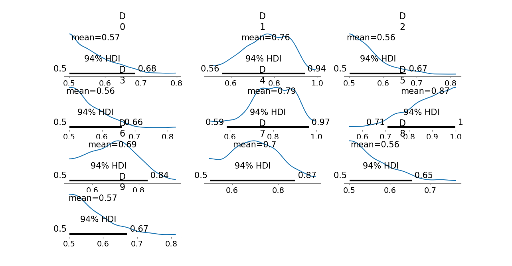

# Cultural Consensus Theory with PyMC Midterm -- Report By Alyssa G. Mendoza

This is an individual project by Alyssa G. Mendoza, for Cogs 107 Midterm Asssignment, due 5/14 @ 12pm. ChatGPT was used overall, for structure, naming, organization, resolving errors, and writing.

To summarize, this project explored a Bayesian Cultural Consensus Theory, or CCT, model with PyMC to assess 20 plant knowledge questions across 10 informants. Informant competence (Dᵢ) was modeled with a Uniform(0.5, 1.0) prior, and consensus answers (Zⱼ) with a Bernoulli(0.5) prior to reflect no initial bias. The likelihood was defined so that the probability of a response depended on whether the true answer was Zⱼ and the informant’s competence Dᵢ, using reshaping to match dimensions.

For posterior sampling, I initially aimed for 2000 draws and 4 chains, but due to seeing a longer predicted runtime of roughly 1hr30min, I experimented and ultimately used 300 draws across 2 chains. This brought the time duration down to about 30 minutes, so runtime constraints were effectively addressed. R-hat values were mostly acceptable, though a few parameters may benefit from more chains. Additionally, based on posterior means, P6 was the most competent (≈ 0.87), and P3 the least (≈ 0.56). The model’s consensus key differed from the majority vote on **[X]** items, very likely because the CCT model weighted informants by competence, offering a more accurate reflection of shared cultural knowledge.

Furthermore, found below is an image of the posterior distributions for each informant’s competence (Dᵢ), with means and 94% HDIs shown for each.

